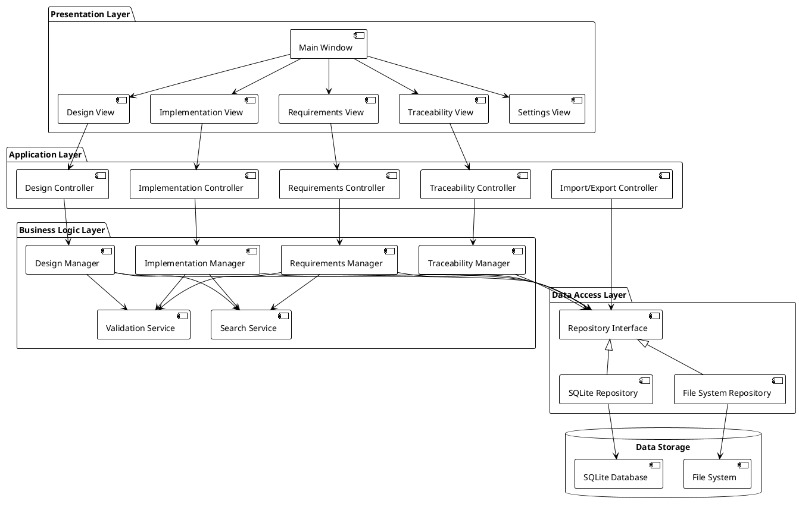
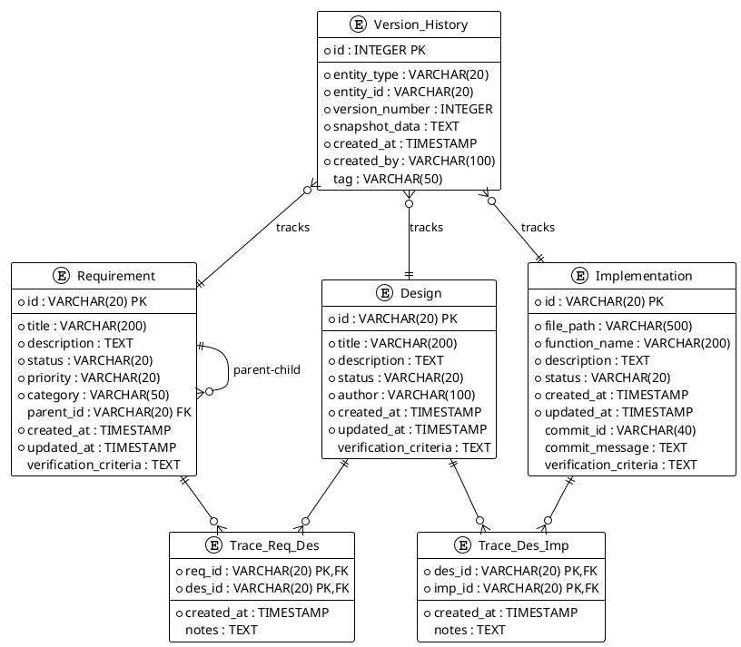
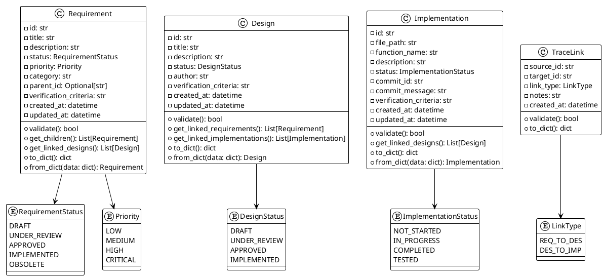
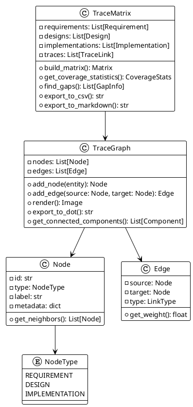
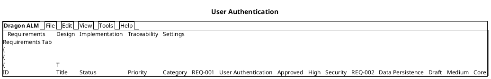
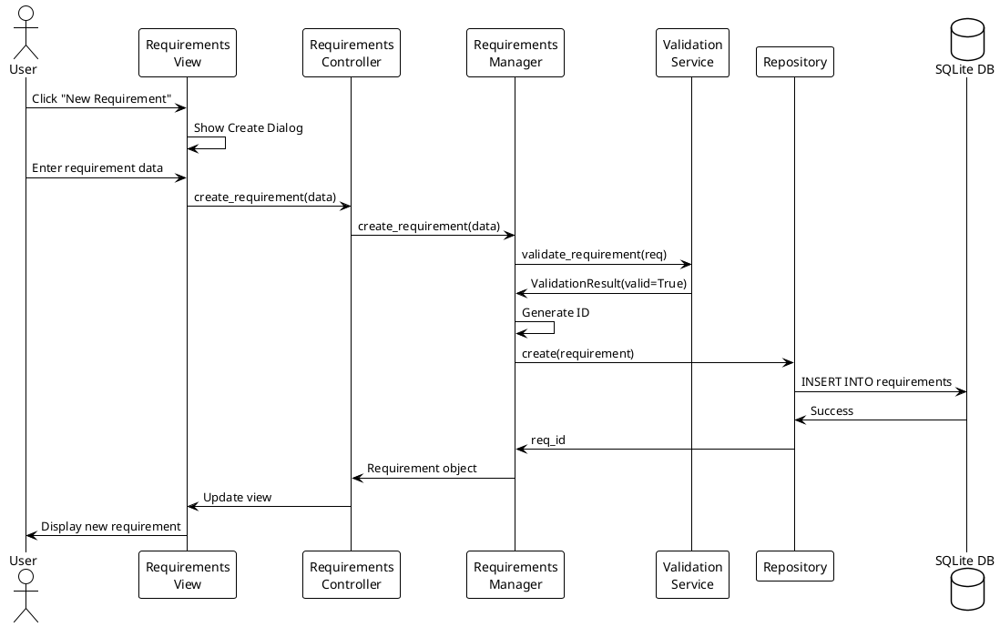
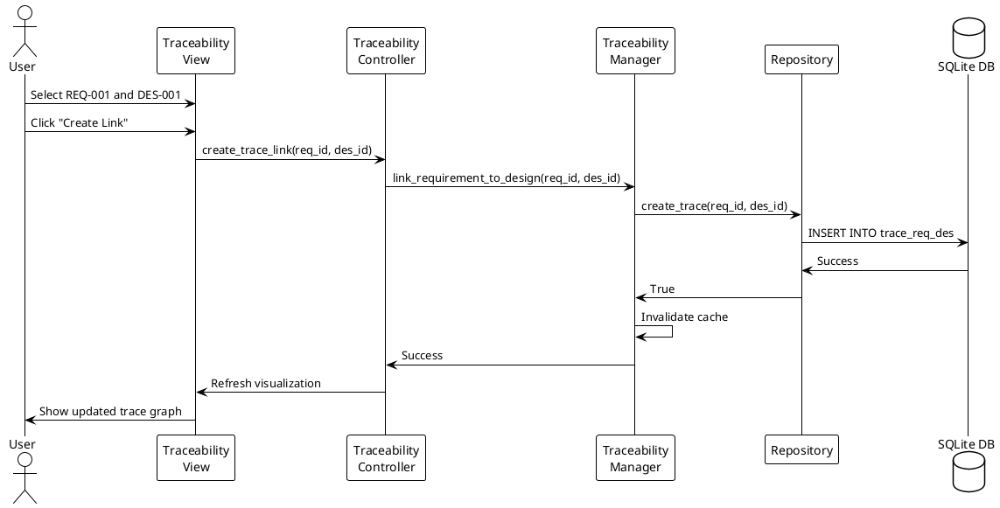
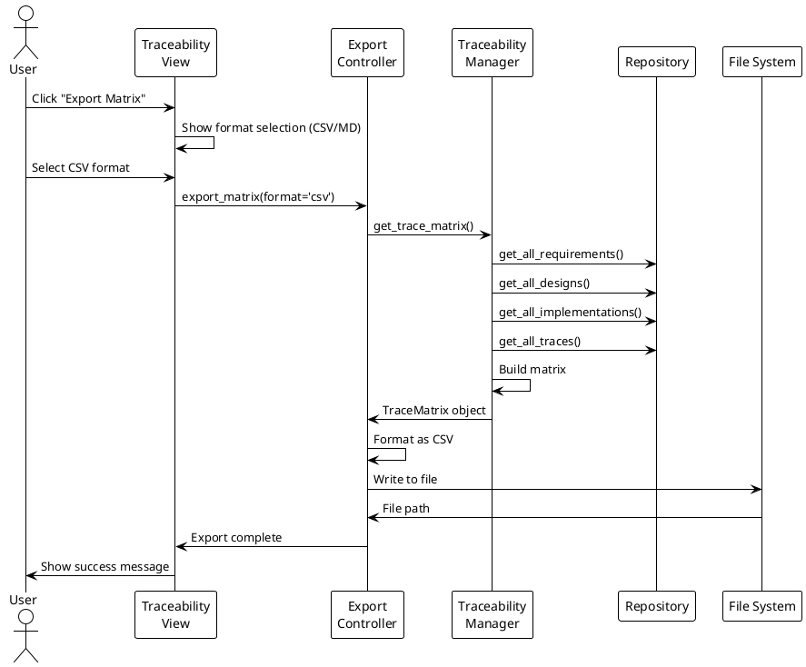

# Dragon Application Lifecycle Management - Design Document

## 1. Overview

### 1.1 Purpose
This document describes the architectural and detailed design of the Dragon ALM system, a desktop-based application lifecycle management tool for individual developers.

### 1.2 Design Principles
- **Modularity**: Clear separation between data, business logic, and presentation layers
- **Maintainability**: MVC pattern with well-defined component responsibilities
- **Extensibility**: Plugin-ready architecture for future enhancements
- **Performance**: Efficient data access and caching strategies
- **Offline-First**: Complete functionality without network dependency

---

## 2. System Architecture

### 2.1 High-Level Architecture



### 2.2 Layer Responsibilities

#### 2.2.1 Presentation Layer
- **Responsibility**: User interface rendering and user interaction handling
- **Technology**: PyQt6 or customtkinter
- **Components**:
  - Main Window: Application container with menu bar and tab navigation
  - View Components: Specialized panels for each artifact type
  - Dialog Components: Modal dialogs for create/edit/delete operations
  - Visualization Components: Graph rendering for traceability matrix

#### 2.2.2 Application Layer (Controllers)
- **Responsibility**: Coordinate between views and business logic
- **Pattern**: MVC Controller pattern
- **Functions**:
  - Handle user actions from views
  - Invoke business logic operations
  - Update view state based on business logic results
  - Manage application state and navigation

#### 2.2.3 Business Logic Layer
- **Responsibility**: Core business rules and domain logic
- **Components**:
  - **Managers**: Domain-specific business logic for each artifact type
  - **Services**: Cross-cutting concerns (validation, search, etc.)
  - **Domain Models**: Entity classes with business behavior

#### 2.2.4 Data Access Layer
- **Responsibility**: Abstract data persistence operations
- **Pattern**: Repository pattern
- **Interface**: Generic CRUD operations and query methods
- **Implementations**:
  - SQLiteRepository: Primary data storage
  - FileSystemRepository: Export/import and backup operations

---

## 3. Data Model Design

### 3.1 Entity Relationship Diagram



### 3.2 Database Schema

#### Requirements Table
```sql
CREATE TABLE requirements (
    id VARCHAR(20) PRIMARY KEY,
    title VARCHAR(200) NOT NULL,
    description TEXT,
    status VARCHAR(20) NOT NULL DEFAULT 'Draft',
    priority VARCHAR(20) NOT NULL DEFAULT 'Medium',
    category VARCHAR(50),
    parent_id VARCHAR(20),
    verification_criteria TEXT,
    created_at TIMESTAMP DEFAULT CURRENT_TIMESTAMP,
    updated_at TIMESTAMP DEFAULT CURRENT_TIMESTAMP,
    FOREIGN KEY (parent_id) REFERENCES requirements(id) ON DELETE SET NULL
);

CREATE INDEX idx_req_status ON requirements(status);
CREATE INDEX idx_req_parent ON requirements(parent_id);
```

#### Design Table
```sql
CREATE TABLE design (
    id VARCHAR(20) PRIMARY KEY,
    title VARCHAR(200) NOT NULL,
    description TEXT,
    status VARCHAR(20) NOT NULL DEFAULT 'Draft',
    author VARCHAR(100),
    verification_criteria TEXT,
    created_at TIMESTAMP DEFAULT CURRENT_TIMESTAMP,
    updated_at TIMESTAMP DEFAULT CURRENT_TIMESTAMP
);

CREATE INDEX idx_des_status ON design(status);
```

#### Implementation Table
```sql
CREATE TABLE implementation (
    id VARCHAR(20) PRIMARY KEY,
    file_path VARCHAR(500) NOT NULL,
    function_name VARCHAR(200),
    description TEXT,
    status VARCHAR(20) NOT NULL DEFAULT 'Not Started',
    commit_id VARCHAR(40),
    commit_message TEXT,
    verification_criteria TEXT,
    created_at TIMESTAMP DEFAULT CURRENT_TIMESTAMP,
    updated_at TIMESTAMP DEFAULT CURRENT_TIMESTAMP
);

CREATE INDEX idx_imp_file ON implementation(file_path);
CREATE INDEX idx_imp_status ON implementation(status);
```

#### Trace Tables
```sql
CREATE TABLE trace_req_des (
    req_id VARCHAR(20),
    des_id VARCHAR(20),
    notes TEXT,
    created_at TIMESTAMP DEFAULT CURRENT_TIMESTAMP,
    PRIMARY KEY (req_id, des_id),
    FOREIGN KEY (req_id) REFERENCES requirements(id) ON DELETE CASCADE,
    FOREIGN KEY (des_id) REFERENCES design(id) ON DELETE CASCADE
);

CREATE TABLE trace_des_imp (
    des_id VARCHAR(20),
    imp_id VARCHAR(20),
    notes TEXT,
    created_at TIMESTAMP DEFAULT CURRENT_TIMESTAMP,
    PRIMARY KEY (des_id, imp_id),
    FOREIGN KEY (des_id) REFERENCES design(id) ON DELETE CASCADE,
    FOREIGN KEY (imp_id) REFERENCES implementation(id) ON DELETE CASCADE
);
```

#### Version History Table
```sql
CREATE TABLE version_history (
    id INTEGER PRIMARY KEY AUTOINCREMENT,
    entity_type VARCHAR(20) NOT NULL,
    entity_id VARCHAR(20) NOT NULL,
    version_number INTEGER NOT NULL,
    snapshot_data TEXT NOT NULL,
    created_at TIMESTAMP DEFAULT CURRENT_TIMESTAMP,
    created_by VARCHAR(100),
    tag VARCHAR(50)
);

CREATE INDEX idx_ver_entity ON version_history(entity_type, entity_id);
CREATE INDEX idx_ver_tag ON version_history(tag);
```

---

## 4. Component Design

### 4.1 Domain Models



### 4.2 Manager Classes

```plantuml
@startuml
!theme plain

interface IRepository {
  + create(entity): str
  + read(id: str): Entity
  + update(entity): bool
  + delete(id: str): bool
  + find_all(): List[Entity]
  + find_by_criteria(criteria): List[Entity]
}

class RequirementManager {
  - repository: IRepository
  - validation_service: ValidationService
  --
  + create_requirement(data: dict): Requirement
  + update_requirement(id: str, data: dict): Requirement
  + delete_requirement(id: str): bool
  + get_requirement(id: str): Requirement
  + get_all_requirements(): List[Requirement]
  + search_requirements(query: str): List[Requirement]
  + get_children(parent_id: str): List[Requirement]
  + link_to_design(req_id: str, des_id: str): bool
  + unlink_from_design(req_id: str, des_id: str): bool
}

class DesignManager {
  - repository: IRepository
  - validation_service: ValidationService
  --
  + create_design(data: dict): Design
  + update_design(id: str, data: dict): Design
  + delete_design(id: str): bool
  + get_design(id: str): Design
  + get_all_designs(): List[Design]
  + search_designs(query: str): List[Design]
  + link_to_requirement(des_id: str, req_id: str): bool
  + link_to_implementation(des_id: str, imp_id: str): bool
  + unlink_from_requirement(des_id: str, req_id: str): bool
  + unlink_from_implementation(des_id: str, imp_id: str): bool
}

class ImplementationManager {
  - repository: IRepository
  - validation_service: ValidationService
  --
  + create_implementation(data: dict): Implementation
  + update_implementation(id: str, data: dict): Implementation
  + delete_implementation(id: str): bool
  + get_implementation(id: str): Implementation
  + get_all_implementations(): List[Implementation]
  + search_implementations(query: str): List[Implementation]
  + link_to_design(imp_id: str, des_id: str): bool
  + unlink_from_design(imp_id: str, des_id: str): bool
  + update_version_info(id: str, commit_id: str, message: str): bool
}

class TraceabilityManager {
  - repository: IRepository
  --
  + get_trace_matrix(): TraceMatrix
  + get_forward_trace(req_id: str): TraceResult
  + get_backward_trace(imp_id: str): TraceResult
  + get_orphaned_items(): OrphanedItems
  + export_trace_matrix(format: str): str
  + visualize_traces(): Graph
}

class ValidationService {
  + validate_requirement(req: Requirement): ValidationResult
  + validate_design(des: Design): ValidationResult
  + validate_implementation(imp: Implementation): ValidationResult
  + validate_trace_link(link: TraceLink): ValidationResult
}

class SearchService {
  + search_all(query: str): SearchResult
  + search_by_type(type: str, query: str): List[Entity]
  + filter_by_status(entities: List[Entity], status: str): List[Entity]
  + filter_by_date_range(entities: List[Entity], start: date, end: date): List[Entity]
}

RequirementManager --> IRepository
DesignManager --> IRepository
ImplementationManager --> IRepository
TraceabilityManager --> IRepository

RequirementManager --> ValidationService
DesignManager --> ValidationService
ImplementationManager --> ValidationService

RequirementManager --> SearchService
DesignManager --> SearchService
ImplementationManager --> SearchService

@enduml
```



### 4.3 Traceability Visualization



---

## 5. User Interface Design

### 5.1 Main Window Layout



### 5.2 Traceability View

```plantuml
@startuml
!theme plain

rectangle "Traceability View" {
  rectangle "Filter Panel" as filter {
    (Status)
    (Priority)
    (Date Range)
    (Entity Type)
  }

  rectangle "Visualization Panel" as viz {
    rectangle "REQ-001\nAuthentication" as req1 #lightblue
    rectangle "REQ-002\nData Layer" as req2 #lightblue

    rectangle "DES-001\nAuth Module" as des1 #lightgreen
    rectangle "DES-002\nDB Schema" as des2 #lightgreen

    rectangle "IMP-001\nauth.py" as imp1 #lightyellow
    rectangle "IMP-002\ndb.py" as imp2 #lightyellow

    req1 --> des1
    req2 --> des2
    des1 --> imp1
    des2 --> imp2
  }

  rectangle "Statistics Panel" as stats {
    - Total Requirements: 125
    - Requirements with Design: 98 (78%)
    - Designs with Implementation: 65 (75%)
    - Orphaned Requirements: 27
    - Orphaned Implementations: 15
  }
}

filter -down-> viz
viz -down-> stats

@enduml
```

---

## 6. Key Design Decisions

### 6.1 ID Generation Strategy
- **Format**: `{PREFIX}-{NUMBER}` (e.g., REQ-001, DES-001, IMP-001)
- **Implementation**: Auto-increment with prefix based on entity type
- **Rationale**: Human-readable, sortable, and supports easy referencing

### 6.2 Trace Link Management
- **Approach**: Separate junction tables for each trace relationship type
- **Benefits**:
  - Explicit relationship modeling
  - Easy query and navigation
  - Support for relationship metadata (notes, dates)
- **Trade-off**: More tables but clearer semantics

### 6.3 Version History
- **Strategy**: Snapshot-based versioning with JSON serialization
- **Triggers**: Manual tagging and automatic change detection
- **Storage**: Compressed JSON in TEXT column
- **Rationale**: Simple implementation, full history retention, easy restore

### 6.4 Search and Filter
- **Implementation**: In-memory filtering with SQLite FTS5 extension for full-text search
- **Indexing**: Strategic indexes on frequently queried columns (status, dates, IDs)
- **Performance**: Query optimization for 1000+ items

### 6.5 Export Formats
- **CSV**: Simple tabular data for spreadsheet tools
- **Markdown**: Documentation-friendly format with links
- **JSON**: Full data export for backup and migration
- **DOT/GraphML**: Graph visualization for traceability

---

## 7. Sequence Diagrams

### 7.1 Create Requirement Flow



### 7.2 Trace Link Creation Flow



### 7.3 Export Traceability Matrix Flow



---

## 8. Error Handling Strategy

### 8.1 Error Categories
1. **Validation Errors**: Invalid input data
2. **Database Errors**: Connection, constraint violations
3. **File I/O Errors**: Import/export failures
4. **Business Logic Errors**: Circular dependencies, orphaned links

### 8.2 Error Handling Pattern
```python
class ALMException(Exception):
    """Base exception for ALM system"""
    pass

class ValidationError(ALMException):
    """Raised when validation fails"""
    pass

class DatabaseError(ALMException):
    """Raised on database operations"""
    pass

class TraceError(ALMException):
    """Raised on trace link operations"""
    pass
```

### 8.3 User Feedback
- **Error Messages**: Clear, actionable messages in dialog boxes
- **Logging**: Comprehensive logging to file for debugging
- **Rollback**: Transaction-based operations with automatic rollback on failure

---

## 9. Performance Considerations

### 9.1 Caching Strategy
- **Entity Cache**: LRU cache for frequently accessed entities
- **Trace Cache**: In-memory graph structure for traceability queries
- **Search Index**: Materialized view for full-text search

### 9.2 Database Optimization
- **Indexes**: Strategic indexes on foreign keys and filter columns
- **Batch Operations**: Bulk inserts/updates for import operations
- **Connection Pooling**: Reuse database connections

### 9.3 UI Responsiveness
- **Lazy Loading**: Load data on-demand for large datasets
- **Pagination**: Display limited rows with pagination controls
- **Background Tasks**: Long-running operations in separate threads

---

## 10. Testing Strategy

### 10.1 Unit Tests
- Test each manager class independently
- Mock repository layer
- Test validation logic thoroughly

### 10.2 Integration Tests
- Test end-to-end flows with real database
- Test trace link integrity
- Test import/export operations

### 10.3 UI Tests
- Manual testing of all UI interactions
- Test responsiveness with large datasets
- Test error handling and user feedback

---

## 11. Implementation Phases

### Phase 1: Core Foundation
- Database schema setup
- Domain models
- Repository implementation
- Basic CRUD operations

### Phase 2: Business Logic
- Manager classes
- Validation service
- Search service
- Trace link management

### Phase 3: User Interface
- Main window and tabs
- Requirements view
- Design view
- Implementation view

### Phase 4: Traceability
- Trace matrix generation
- Visualization
- Export functionality

### Phase 5: Advanced Features
- Version history
- Import/export
- Backup/restore
- Settings and preferences

---

## 12. Glossary

| Term | Definition |
|------|------------|
| Entity | Base abstraction for Requirement, Design, or Implementation |
| Trace Link | Relationship between two entities |
| Trace Matrix | Tabular view showing all trace relationships |
| Forward Trace | Navigation from requirements to implementation |
| Backward Trace | Navigation from implementation to requirements |
| Orphaned Item | Entity with no trace links |
| Coverage | Percentage of items with trace links |
