# Dragon Application Lifecycle Management - Design Document

## 1. Overview

### 1.1 Purpose
This document describes the architectural and detailed design of the Dragon ALM system, a desktop-based application lifecycle management tool for individual developers.

### 1.2 Design Principles
- **Modularity**: Clear separation between data, business logic, and presentation layers
- **Maintainability**: MVC pattern with well-defined component responsibilities
- **Extensibility**: Plugin-ready architecture for future enhancements
- **Performance**: Efficient data access and caching strategies
- **Offline-First**: Complete functionality without network dependency

---

## 2. System Architecture

### 2.1 High-Level Architecture

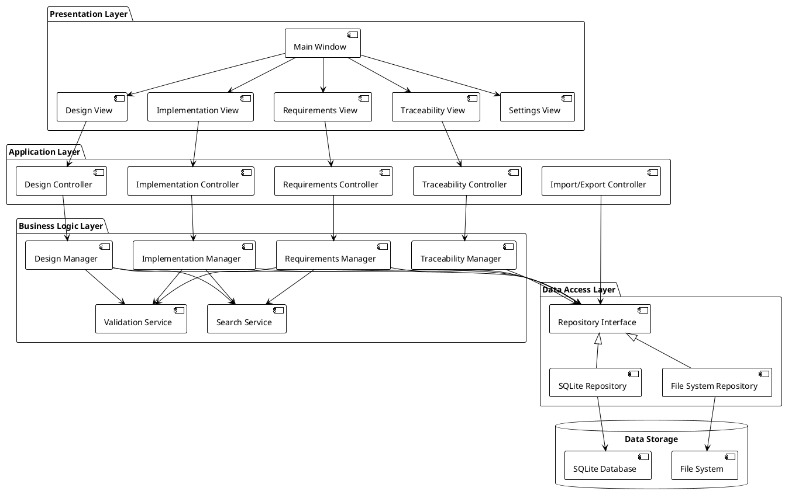

### 2.2 Layer Responsibilities

#### 2.2.1 Presentation Layer
- **Responsibility**: User interface rendering and user interaction handling
- **Technology**: PyQt6 or customtkinter
- **Components**:
  - Main Window: Application container with menu bar and tab navigation
  - View Components: Specialized panels for each artifact type
  - Dialog Components: Modal dialogs for create/edit/delete operations
  - Visualization Components: Graph rendering for traceability matrix

#### 2.2.2 Application Layer (Controllers)
- **Responsibility**: Coordinate between views and business logic
- **Pattern**: MVC Controller pattern
- **Functions**:
  - Handle user actions from views
  - Invoke business logic operations
  - Update view state based on business logic results
  - Manage application state and navigation

#### 2.2.3 Business Logic Layer
- **Responsibility**: Core business rules and domain logic
- **Components**:
  - **Managers**: Domain-specific business logic for each artifact type
  - **Services**: Cross-cutting concerns (validation, search, etc.)
  - **Domain Models**: Entity classes with business behavior

#### 2.2.4 Data Access Layer
- **Responsibility**: Abstract data persistence operations
- **Pattern**: Repository pattern
- **Interface**: Generic CRUD operations and query methods
- **Implementations**:
  - SQLiteRepository: Primary data storage
  - FileSystemRepository: Export/import and backup operations

---

## 3. Data Model Design

### 3.1 Entity Relationship Diagram

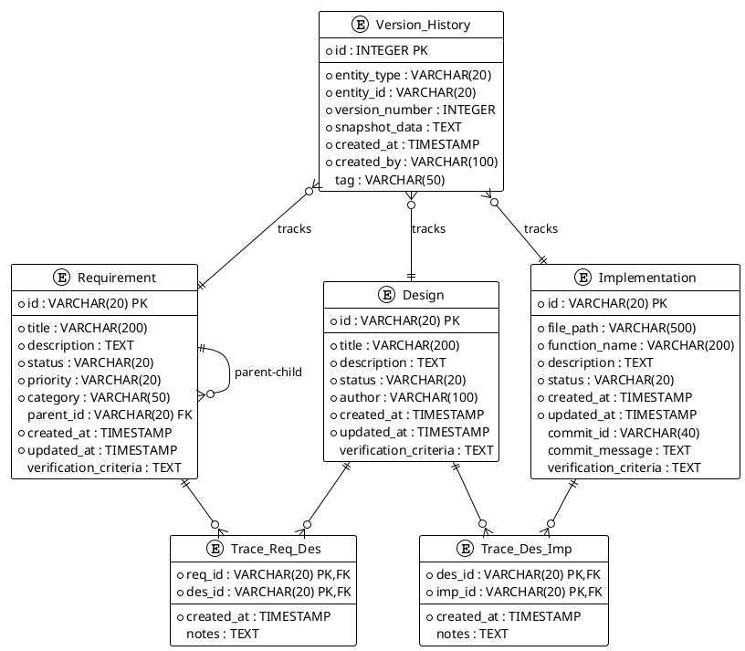

### 3.2 Database Schema

#### Requirements Table
```sql
CREATE TABLE requirements (
    id VARCHAR(20) PRIMARY KEY,
    title VARCHAR(200) NOT NULL,
    description TEXT,
    status VARCHAR(20) NOT NULL DEFAULT 'Draft',
    priority VARCHAR(20) NOT NULL DEFAULT 'Medium',
    category VARCHAR(50),
    parent_id VARCHAR(20),
    verification_criteria TEXT,
    created_at TIMESTAMP DEFAULT CURRENT_TIMESTAMP,
    updated_at TIMESTAMP DEFAULT CURRENT_TIMESTAMP,
    FOREIGN KEY (parent_id) REFERENCES requirements(id) ON DELETE SET NULL
);

CREATE INDEX idx_req_status ON requirements(status);
CREATE INDEX idx_req_parent ON requirements(parent_id);
```

#### Design Table
```sql
CREATE TABLE design (
    id VARCHAR(20) PRIMARY KEY,
    title VARCHAR(200) NOT NULL,
    description TEXT,
    status VARCHAR(20) NOT NULL DEFAULT 'Draft',
    author VARCHAR(100),
    verification_criteria TEXT,
    created_at TIMESTAMP DEFAULT CURRENT_TIMESTAMP,
    updated_at TIMESTAMP DEFAULT CURRENT_TIMESTAMP
);

CREATE INDEX idx_des_status ON design(status);
```

#### Implementation Table
```sql
CREATE TABLE implementation (
    id VARCHAR(20) PRIMARY KEY,
    file_path VARCHAR(500) NOT NULL,
    function_name VARCHAR(200),
    description TEXT,
    status VARCHAR(20) NOT NULL DEFAULT 'Not Started',
    commit_id VARCHAR(40),
    commit_message TEXT,
    verification_criteria TEXT,
    created_at TIMESTAMP DEFAULT CURRENT_TIMESTAMP,
    updated_at TIMESTAMP DEFAULT CURRENT_TIMESTAMP
);

CREATE INDEX idx_imp_file ON implementation(file_path);
CREATE INDEX idx_imp_status ON implementation(status);
```

#### Trace Tables
```sql
CREATE TABLE trace_req_des (
    req_id VARCHAR(20),
    des_id VARCHAR(20),
    notes TEXT,
    created_at TIMESTAMP DEFAULT CURRENT_TIMESTAMP,
    PRIMARY KEY (req_id, des_id),
    FOREIGN KEY (req_id) REFERENCES requirements(id) ON DELETE CASCADE,
    FOREIGN KEY (des_id) REFERENCES design(id) ON DELETE CASCADE
);

CREATE TABLE trace_des_imp (
    des_id VARCHAR(20),
    imp_id VARCHAR(20),
    notes TEXT,
    created_at TIMESTAMP DEFAULT CURRENT_TIMESTAMP,
    PRIMARY KEY (des_id, imp_id),
    FOREIGN KEY (des_id) REFERENCES design(id) ON DELETE CASCADE,
    FOREIGN KEY (imp_id) REFERENCES implementation(id) ON DELETE CASCADE
);
```

#### Version History Table
```sql
CREATE TABLE version_history (
    id INTEGER PRIMARY KEY AUTOINCREMENT,
    entity_type VARCHAR(20) NOT NULL,
    entity_id VARCHAR(20) NOT NULL,
    version_number INTEGER NOT NULL,
    snapshot_data TEXT NOT NULL,
    created_at TIMESTAMP DEFAULT CURRENT_TIMESTAMP,
    created_by VARCHAR(100),
    tag VARCHAR(50)
);

CREATE INDEX idx_ver_entity ON version_history(entity_type, entity_id);
CREATE INDEX idx_ver_tag ON version_history(tag);
```

---

## 4. Component Design

### 4.1 Domain Models

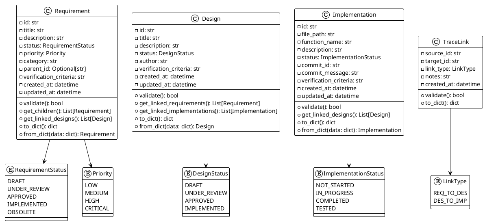

### 4.2 Manager Classes

```plantuml
@startuml
!theme plain

interface IRepository {
  + create(entity): str
  + read(id: str): Entity
  + update(entity): bool
  + delete(id: str): bool
  + find_all(): List[Entity]
  + find_by_criteria(criteria): List[Entity]
}

class RequirementManager {
  - repository: IRepository
  - validation_service: ValidationService
  --
  + create_requirement(data: dict): Requirement
  + update_requirement(id: str, data: dict): Requirement
  + delete_requirement(id: str): bool
  + get_requirement(id: str): Requirement
  + get_all_requirements(): List[Requirement]
  + search_requirements(query: str): List[Requirement]
  + get_children(parent_id: str): List[Requirement]
  + link_to_design(req_id: str, des_id: str): bool
  + unlink_from_design(req_id: str, des_id: str): bool
}

class DesignManager {
  - repository: IRepository
  - validation_service: ValidationService
  --
  + create_design(data: dict): Design
  + update_design(id: str, data: dict): Design
  + delete_design(id: str): bool
  + get_design(id: str): Design
  + get_all_designs(): List[Design]
  + search_designs(query: str): List[Design]
  + link_to_requirement(des_id: str, req_id: str): bool
  + link_to_implementation(des_id: str, imp_id: str): bool
  + unlink_from_requirement(des_id: str, req_id: str): bool
  + unlink_from_implementation(des_id: str, imp_id: str): bool
}

class ImplementationManager {
  - repository: IRepository
  - validation_service: ValidationService
  --
  + create_implementation(data: dict): Implementation
  + update_implementation(id: str, data: dict): Implementation
  + delete_implementation(id: str): bool
  + get_implementation(id: str): Implementation
  + get_all_implementations(): List[Implementation]
  + search_implementations(query: str): List[Implementation]
  + link_to_design(imp_id: str, des_id: str): bool
  + unlink_from_design(imp_id: str, des_id: str): bool
  + update_version_info(id: str, commit_id: str, message: str): bool
}

class TraceabilityManager {
  - repository: IRepository
  --
  + get_trace_matrix(): TraceMatrix
  + get_forward_trace(req_id: str): TraceResult
  + get_backward_trace(imp_id: str): TraceResult
  + get_orphaned_items(): OrphanedItems
  + export_trace_matrix(format: str): str
  + visualize_traces(): Graph
}

class ValidationService {
  + validate_requirement(req: Requirement): ValidationResult
  + validate_design(des: Design): ValidationResult
  + validate_implementation(imp: Implementation): ValidationResult
  + validate_trace_link(link: TraceLink): ValidationResult
}

class SearchService {
  + search_all(query: str): SearchResult
  + search_by_type(type: str, query: str): List[Entity]
  + filter_by_status(entities: List[Entity], status: str): List[Entity]
  + filter_by_date_range(entities: List[Entity], start: date, end: date): List[Entity]
}

RequirementManager --> IRepository
DesignManager --> IRepository
ImplementationManager --> IRepository
TraceabilityManager --> IRepository

RequirementManager --> ValidationService
DesignManager --> ValidationService
ImplementationManager --> ValidationService

RequirementManager --> SearchService
DesignManager --> SearchService
ImplementationManager --> SearchService

@enduml
```

### 4.3 Traceability Visualization

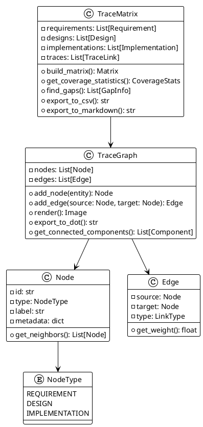

---

## 5. User Interface Design

### 5.1 Main Window Layout


### 5.2 Design View with Traceability

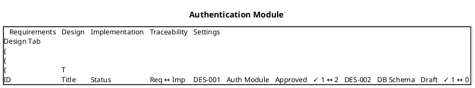

### 5.3 Implementation View with Traceability

```plantuml
@startuml
salt
{+
  {T+
    + Requirements | Design | Implementation | Traceability | Settings
    Implementation Tab
    {
      {
        {T
          | ID | File Path | Function | Status | Traces |
          | IMP-001 | auth.py | authenticate() | Tested | ✓ Path |
          | IMP-002 | db.py | connect() | In Progress | ⚠ No Design |
        }
      } | {
        <b>Details
        ---
        ID: IMP-001
        File: src/auth.py
        Function: authenticate()
        Status: Tested
        Commit: abc123
        ---
        Description:
        { . }
        ---
        <b>Traceability
        <b>Backward Traces - Linked Designs (1):
        ↑ DES-001: Authentication Module [Notes] [×]
        [+ Add Design Link]

        <b>Indirect Requirements (via designs):
        ↑↑ REQ-001: User Authentication (via DES-001)

        <b>Complete Trace Path:
        REQ-001 → DES-001 → IMP-001

        <b>Coverage Status:
        Design Links: ✓ Complete (1/1 expected)
        Requirement Traceability: ✓ Complete
        ---
        [Edit] [Delete] [Version History] [View Code]
      }
    }
  }
}
@enduml
```

### 5.4 Traceability View (Global)

```plantuml
@startuml
!theme plain

rectangle "Traceability View" {
  rectangle "Filter Panel" as filter {
    (Status)
    (Priority)
    (Date Range)
    (Entity Type)
    (Coverage Filter)
  }

  rectangle "Visualization Panel" as viz {
    rectangle "REQ-001\nAuthentication\n✓ Complete" as req1 #lightblue
    rectangle "REQ-002\nData Layer\n⚠ No Design" as req2 #lightyellow

    rectangle "DES-001\nAuth Module\n✓ Complete" as des1 #lightgreen
    rectangle "DES-002\nDB Schema\n⚠ No Impl" as des2 #lightyellow

    rectangle "IMP-001\nauth.py\n✓ Complete" as imp1 #lightgreen
    rectangle "IMP-002\ndb.py\n⚠ No Design" as imp2 #lightyellow

    req1 --> des1 : "Trace note:\nCore feature"
    req2 ..> des2 : "Missing\nlink"
    des1 --> imp1
    des2 ..> imp2 : "Missing\nlink"
  }

  rectangle "Statistics Panel" as stats {
    <b>Coverage Statistics:
    - Total Requirements: 125
    - Requirements with Design: 98 (78%) ✓
    - Designs with Implementation: 65 (75%) ✓
    - Complete Trace Paths: 60 (48%)

    <b>Issues:
    - Orphaned Requirements: 27 ⚠
    - Orphaned Designs: 12 ⚠
    - Orphaned Implementations: 15 ⚠

    [Export Matrix] [Show Gaps] [Fix Orphans]
  }

  rectangle "Actions Panel" as actions {
    [Create Links] [Bulk Link] [Validate All]
  }
}

filter -down-> viz
viz -down-> stats
stats -down-> actions

@enduml
```

### 5.5 Trace Link Dialog

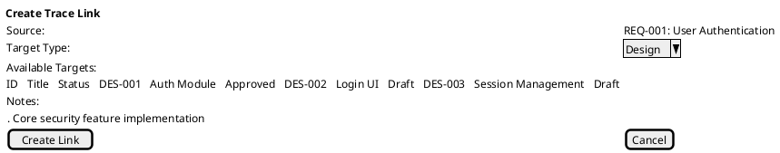

### 5.6 Traceability Panel Component (Reusable)

The traceability panel is a reusable component that appears in all artifact detail views:

```python
class TraceabilityPanel(QWidget):
    """
    Reusable traceability panel for artifact views.
    Shows backward and forward traces with inline actions.
    """
    def __init__(self, artifact_type: str):
        self.artifact_type = artifact_type  # 'requirement', 'design', 'implementation'
        self.backward_section = TraceLinkSection("backward")
        self.forward_section = TraceLinkSection("forward")
        self.coverage_indicator = CoverageIndicator()
        self.trace_path_view = TracePathView()

    def display_traces(self, artifact_id: str):
        """Display all traces for the given artifact"""
        pass

    def add_link_action(self, direction: str):
        """Handle adding a new trace link"""
        pass

    def remove_link_action(self, link_id: str):
        """Handle removing a trace link"""
        pass

    def navigate_to_linked_artifact(self, artifact_id: str):
        """Navigate to the linked artifact"""
        pass

class TraceLinkSection(QWidget):
    """
    Section showing trace links in one direction.
    Displays: icon, artifact_id, title, [notes] [×]
    """
    pass

class CoverageIndicator(QWidget):
    """
    Visual indicator of traceability coverage.
    Shows: ✓ Complete, ⚠ Partial, × Missing
    """
    pass

class TracePathView(QWidget):
    """
    Displays complete trace paths.
    Example: REQ-001 → DES-001 → IMP-001
    """
    pass
```

---

## 6. Key Design Decisions

### 6.1 ID Generation Strategy
- **Format**: `{PREFIX}-{NUMBER}` (e.g., REQ-001, DES-001, IMP-001)
- **Implementation**: Auto-increment with prefix based on entity type
- **Rationale**: Human-readable, sortable, and supports easy referencing

### 6.2 Trace Link Management
- **Approach**: Separate junction tables for each trace relationship type
- **Benefits**:
  - Explicit relationship modeling
  - Easy query and navigation
  - Support for relationship metadata (notes, dates)
- **Trade-off**: More tables but clearer semantics

### 6.3 In-View Traceability Display
- **Strategy**: Embed traceability information directly in artifact detail panels
- **Benefits**:
  - Immediate visibility of relationships
  - Reduced context switching
  - Faster link management
  - Better understanding of artifact context
- **Implementation**: Reusable TraceabilityPanel component
- **Performance**: Lazy loading of trace data when artifact is selected

### 6.4 Trace Link Notes
- **Purpose**: Provide context for why artifacts are linked
- **Storage**: TEXT field in trace junction tables
- **Display**: Inline with trace links, expandable for long notes
- **Edit**: Quick edit action without modal dialog

### 6.5 Coverage Indicators
- **Visual Design**: Color-coded badges (green ✓, yellow ⚠, red ×)
- **Levels**:
  - ✓ Complete: All expected traces exist
  - ⚠ Partial: Some traces exist but incomplete
  - × Missing: No traces exist
- **Display**: In table columns, detail panels, and statistics

### 6.6 Version History
- **Strategy**: Snapshot-based versioning with JSON serialization
- **Triggers**: Manual tagging and automatic change detection
- **Storage**: Compressed JSON in TEXT column
- **Rationale**: Simple implementation, full history retention, easy restore

### 6.7 Search and Filter
- **Implementation**: In-memory filtering with SQLite FTS5 extension for full-text search
- **Indexing**: Strategic indexes on frequently queried columns (status, dates, IDs)
- **Performance**: Query optimization for 1000+ items

### 6.8 Export Formats
- **CSV**: Simple tabular data for spreadsheet tools
- **Markdown**: Documentation-friendly format with links
- **JSON**: Full data export for backup and migration
- **DOT/GraphML**: Graph visualization for traceability
```

```markdown path=/Users/jaeyong/workspace/dragon/dragon-alm/design.md start_line=325 end_line=440
---

## 4. Component Design

### 4.1 Domain Models

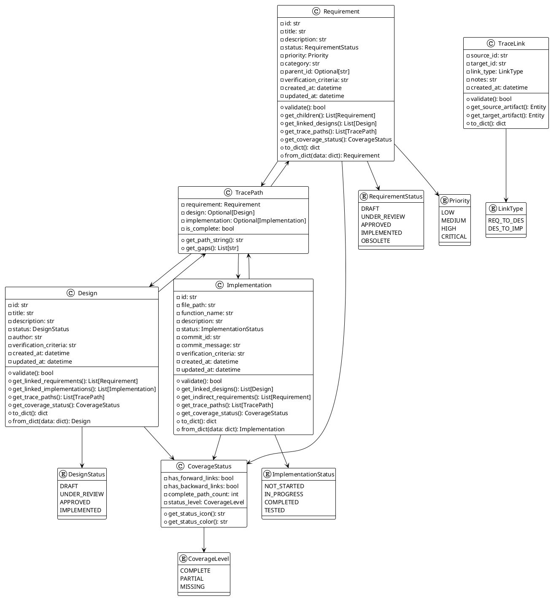

### 4.2 Manager Classes

```plantuml
@startuml
!theme plain

interface IRepository {
  + create(entity): str
  + read(id: str): Entity
  + update(entity): bool
  + delete(id: str): bool
  + find_all(): List[Entity]
  + find_by_criteria(criteria): List[Entity]
}

class RequirementManager {
  - repository: IRepository
  - validation_service: ValidationService
  - trace_service: TraceService
  --
  + create_requirement(data: dict): Requirement
  + update_requirement(id: str, data: dict): Requirement
  + delete_requirement(id: str): bool
  + get_requirement(id: str): Requirement
  + get_all_requirements(): List[Requirement]
  + search_requirements(query: str): List[Requirement]
  + get_children(parent_id: str): List[Requirement]
  + get_linked_designs(req_id: str): List[Design]
  + get_trace_paths(req_id: str): List[TracePath]
  + get_coverage_status(req_id: str): CoverageStatus
  + link_to_design(req_id: str, des_id: str, notes: str): bool
  + unlink_from_design(req_id: str, des_id: str): bool
  + update_trace_notes(req_id: str, des_id: str, notes: str): bool
}

class DesignManager {
  - repository: IRepository
  - validation_service: ValidationService
  - trace_service: TraceService
  --
  + create_design(data: dict): Design
  + update_design(id: str, data: dict): Design
  + delete_design(id: str): bool
  + get_design(id: str): Design
  + get_all_designs(): List[Design]
  + search_designs(query: str): List[Design]
  + get_linked_requirements(des_id: str): List[Requirement]
  + get_linked_implementations(des_id: str): List[Implementation]
  + get_trace_paths(des_id: str): List[TracePath]
  + get_coverage_status(des_id: str): CoverageStatus
  + link_to_requirement(des_id: str, req_id: str, notes: str): bool
  + link_to_implementation(des_id: str, imp_id: str, notes: str): bool
  + unlink_from_requirement(des_id: str, req_id: str): bool
  + unlink_from_implementation(des_id: str, imp_id: str): bool
  + update_trace_notes(des_id: str, target_id: str, notes: str): bool
}

class ImplementationManager {
  - repository: IRepository
  - validation_service: ValidationService
  - trace_service: TraceService
  --
  + create_implementation(data: dict): Implementation
  + update_implementation(id: str, data: dict): Implementation
  + delete_implementation(id: str): bool
  + get_implementation(id: str): Implementation
  + get_all_implementations(): List[Implementation]
  + search_implementations(query: str): List[Implementation]
  + get_linked_designs(imp_id: str): List[Design]
  + get_indirect_requirements(imp_id: str): List[Requirement]
  + get_trace_paths(imp_id: str): List[TracePath]
  + get_coverage_status(imp_id: str): CoverageStatus
  + link_to_design(imp_id: str, des_id: str, notes: str): bool
  + unlink_from_design(imp_id: str, des_id: str): bool
  + update_trace_notes(imp_id: str, des_id: str, notes: str): bool
  + update_version_info(id: str, commit_id: str, message: str): bool
}

class TraceabilityManager {
  - repository: IRepository
  --
  + get_trace_matrix(): TraceMatrix
  + get_forward_trace(req_id: str): TraceResult
  + get_backward_trace(imp_id: str): TraceResult
  + get_trace_paths(artifact_id: str): List[TracePath]
  + get_orphaned_items(): OrphanedItems
  + calculate_coverage(): CoverageStatistics
  + export_trace_matrix(format: str): str
  + visualize_traces(): Graph
}

class TraceService {
  - repository: IRepository
  --
  + get_linked_artifacts(artifact_id: str, direction: str): List[Entity]
  + create_trace_link(source_id: str, target_id: str, notes: str): TraceLink
  + delete_trace_link(source_id: str, target_id: str): bool
  + update_trace_notes(source_id: str, target_id: str, notes: str): bool
  + get_trace_link_details(source_id: str, target_id: str): TraceLink
  + build_trace_paths(artifact_id: str): List[TracePath]
  + calculate_coverage_status(artifact_id: str, artifact_type: str): CoverageStatus
  + validate_trace_link(source_id: str, target_id: str): ValidationResult
}

class ValidationService {
  + validate_requirement(req: Requirement): ValidationResult
  + validate_design(des: Design): ValidationResult
  + validate_implementation(imp: Implementation): ValidationResult
  + validate_trace_link(link: TraceLink): ValidationResult
}

class SearchService {
  + search_all(query: str): SearchResult
  + search_by_type(type: str, query: str): List[Entity]
  + filter_by_status(entities: List[Entity], status: str): List[Entity]
  + filter_by_date_range(entities: List[Entity], start: date, end: date): List[Entity]
  + filter_by_coverage(entities: List[Entity], level: CoverageLevel): List[Entity]
}

RequirementManager --> IRepository
DesignManager --> IRepository
ImplementationManager --> IRepository
TraceabilityManager --> IRepository

RequirementManager --> ValidationService
DesignManager --> ValidationService
ImplementationManager --> ValidationService

RequirementManager --> TraceService
DesignManager --> TraceService
ImplementationManager --> TraceService

RequirementManager --> SearchService
DesignManager --> SearchService
ImplementationManager --> SearchService

@enduml
```
```

These updates provide:

1. **In-View Traceability**: Each artifact view (requirement, design, implementation) now displays its trace relationships directly in the detail panel
2. **Bidirectional Navigation**: Users can see both forward and backward traces without leaving the current view
3. **Quick Actions**: Add/remove trace links directly from artifact views
4. **Coverage Indicators**: Visual status badges showing traceability completeness
5. **Complete Trace Paths**: Shows the full requirement → design → implementation chain
6. **Reusable Components**: TraceabilityPanel component can be embedded in all artifact views
7. **Enhanced Domain Models**: Added methods for getting trace paths and coverage status
8. **New TraceService**: Centralized service for trace link operations used across all managers

The design maintains separation of concerns while providing rich traceability features directly in the context where users need them.

---

## 7. Sequence Diagrams

### 7.1 Create Requirement Flow

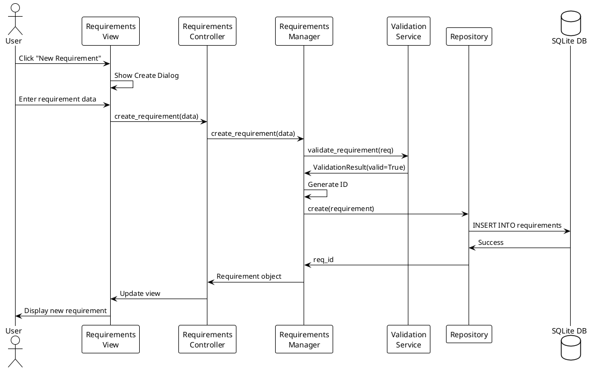

### 7.2 Trace Link Creation Flow

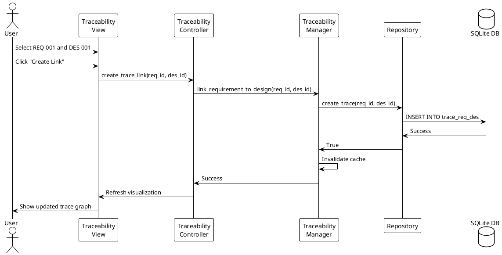

### 7.3 Export Traceability Matrix Flow

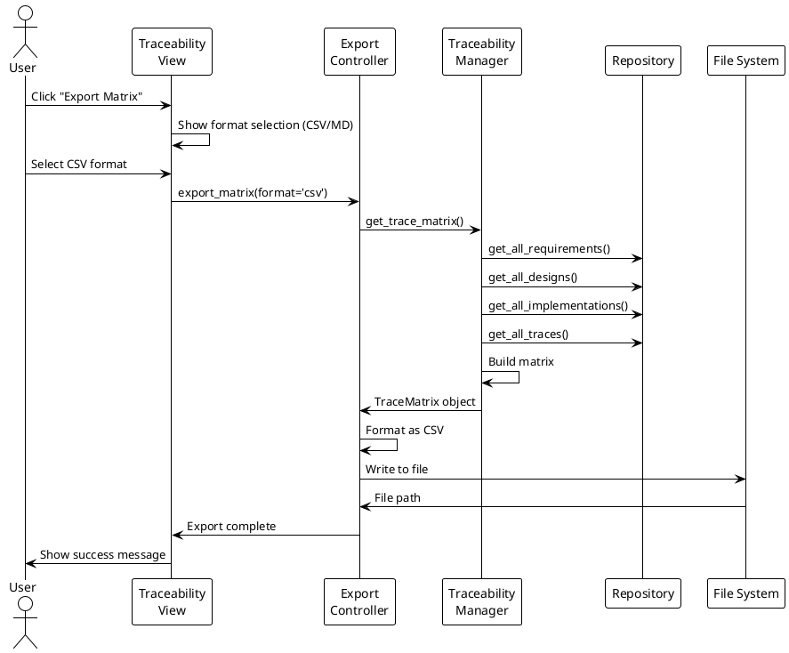

---

## 8. Error Handling Strategy

### 8.1 Error Categories
1. **Validation Errors**: Invalid input data
2. **Database Errors**: Connection, constraint violations
3. **File I/O Errors**: Import/export failures
4. **Business Logic Errors**: Circular dependencies, orphaned links

### 8.2 Error Handling Pattern
```python
class ALMException(Exception):
    """Base exception for ALM system"""
    pass

class ValidationError(ALMException):
    """Raised when validation fails"""
    pass

class DatabaseError(ALMException):
    """Raised on database operations"""
    pass

class TraceError(ALMException):
    """Raised on trace link operations"""
    pass
```

### 8.3 User Feedback
- **Error Messages**: Clear, actionable messages in dialog boxes
- **Logging**: Comprehensive logging to file for debugging
- **Rollback**: Transaction-based operations with automatic rollback on failure

---

## 9. Performance Considerations

### 9.1 Caching Strategy
- **Entity Cache**: LRU cache for frequently accessed entities
- **Trace Cache**: In-memory graph structure for traceability queries
- **Search Index**: Materialized view for full-text search

### 9.2 Database Optimization
- **Indexes**: Strategic indexes on foreign keys and filter columns
- **Batch Operations**: Bulk inserts/updates for import operations
- **Connection Pooling**: Reuse database connections

### 9.3 UI Responsiveness
- **Lazy Loading**: Load data on-demand for large datasets
- **Pagination**: Display limited rows with pagination controls
- **Background Tasks**: Long-running operations in separate threads

---

## 10. Testing Strategy

### 10.1 Unit Tests
- Test each manager class independently
- Mock repository layer
- Test validation logic thoroughly

### 10.2 Integration Tests
- Test end-to-end flows with real database
- Test trace link integrity
- Test import/export operations

### 10.3 UI Tests
- Manual testing of all UI interactions
- Test responsiveness with large datasets
- Test error handling and user feedback

---

## 11. Implementation Phases

### Phase 1: Core Foundation
- Database schema setup
- Domain models
- Repository implementation
- Basic CRUD operations

### Phase 2: Business Logic
- Manager classes
- Validation service
- Search service
- Trace link management

### Phase 3: User Interface
- Main window and tabs
- Requirements view
- Design view
- Implementation view

### Phase 4: Traceability
- Trace matrix generation
- Visualization
- Export functionality

### Phase 5: Advanced Features
- Version history
- Import/export
- Backup/restore
- Settings and preferences

---

## 12. Glossary

| Term | Definition |
|------|------------|
| Entity | Base abstraction for Requirement, Design, or Implementation |
| Trace Link | Relationship between two entities |
| Trace Matrix | Tabular view showing all trace relationships |
| Forward Trace | Navigation from requirements to implementation |
| Backward Trace | Navigation from implementation to requirements |
| Orphaned Item | Entity with no trace links |
